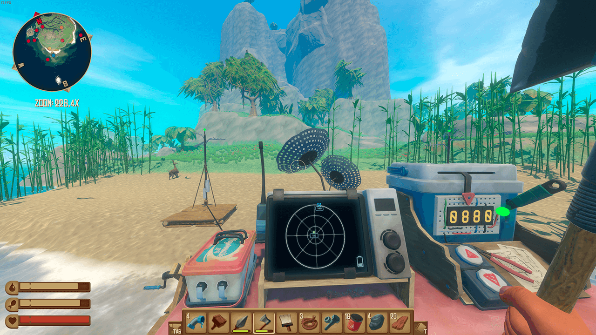
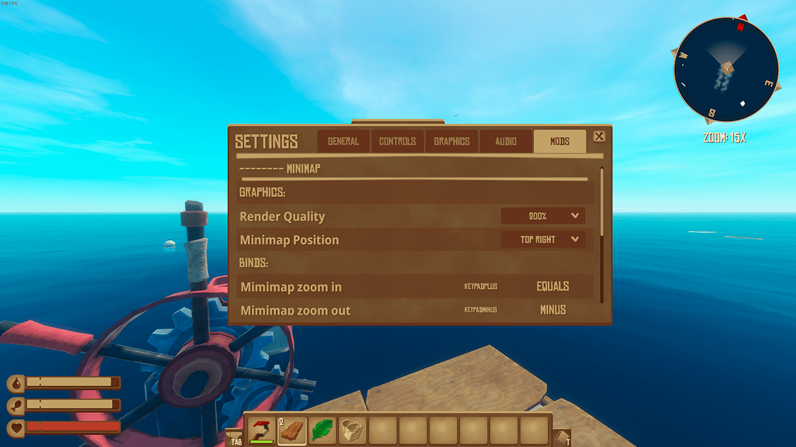

![Banner]

[![Badge License]][License]

 
 

*A **[Raft]** mod that add a minimap.*

 
 
 

[![Button RaftModding]][RaftModding]

 
 
 

   

 
 
 

## Features

-   Zoom with  <kbd>  +  </kbd>  &  <kbd>  -  </kbd>

-   Drag the minimap by pressing  
    <kbd>  M  </kbd>  and moving your mouse.

 

### Adjustable

-   Minimap Placement

-   Rendering Quality

-   Default Zoom Level

-   Camera Level

    ` -100 ➞ 200 `  (  Default  :  ` 200 `  )

    Set how high the minimap camera  
    should be above sea level by using  
    the  ` Minimap Render Near Clip `  
    option in the settings menu.
    
    *This can be helpful for  Tangaroa's dome.*
    
-   Zoom Speed

    ` 0% ➞ 500% `

 

### Togglable

-   Markers

-   Cave Mode

    In cave mode the minimap camera will clip  
    ` 1 `  unit above player and  ` 2 `  units below.
    
    *Very helpful for Tangaroa's tunnels.*

 
 

## Marks

*Types of indicators of the map.*

 

![Badge Major]

![Badge Neutral]

![Badge Enemy]

![Badge Player]

![Badge NPC]

 
 

## Mods

*Other mods I made.*

 

[][Leaves As Compost]
[][Better Steering Wheel]

 
 

## Contact

[![Button Telegram]][Telegram]   
[![Button Vk]][Vk]   
![Button Discord]

 

<!----------------------------------------------------------------------------->

[Better Steering Wheel]: https://www.raftmodding.com/mods/better-steering-wheel
[Leaves As Compost]: https://www.raftmodding.com/mods/leaves-as-compost
[RaftModding]: https://www.raftmodding.com/mods/minimap
[Telegram]: https://tg.brim.ml/
[Banner]: Minimap/banner.png
[Raft]: https://raft-game.com/
[Vk]: https://vk.brim.ml/

[License]: LICENSE

<!----------------------------------[ Badges ]--------------------------------->

[Badge License]: https://img.shields.io/badge/License-AGPL3-015d93.svg?style=for-the-badge&labelColor=blue

[Badge Neutral]: https://img.shields.io/badge/Domestic_Animals_+_Bees-E0A918?style=for-the-badge&logoColor=white&logo=GoogleMaps
[Badge Player]: https://img.shields.io/badge/Players-47AB3C?style=for-the-badge&logoColor=white&logo=GoogleMaps
[Badge Enemy]: https://img.shields.io/badge/Hostile_Creatures-CC3148?style=for-the-badge&logoColor=white&logo=GoogleMaps
[Badge Major]: https://img.shields.io/badge/Shark_+_Dolphins_+_Whale-2679CC?style=for-the-badge&logoColor=white&logo=GoogleMaps
[Badge NPC]: https://img.shields.io/badge/NPC-FC60A8?style=for-the-badge&logoColor=white&logo=GoogleMaps

<!---------------------------------[ Buttons ]--------------------------------->

[Button RaftModding]: https://img.shields.io/badge/RaftModding-3498db?style=for-the-badge&logoColor=white&logo=Wireshark
[Button Telegram]: https://img.shields.io/badge/Telegram-26A5E4?style=for-the-badge&logoColor=white&logo=Telegram
[Button Discord]: https://img.shields.io/badge/-Whitebrim%234444-5865F2?style=for-the-badge&logoColor=white&logo=Discord
[Button Vk]: https://img.shields.io/badge/Vk-0077FF?style=for-the-badge&logoColor=white&logo=VK
